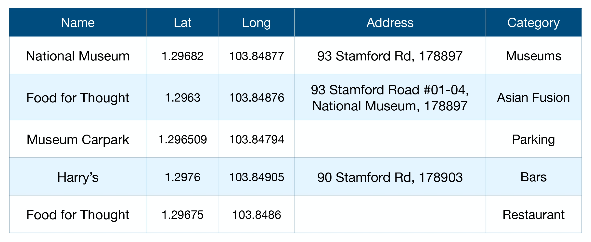
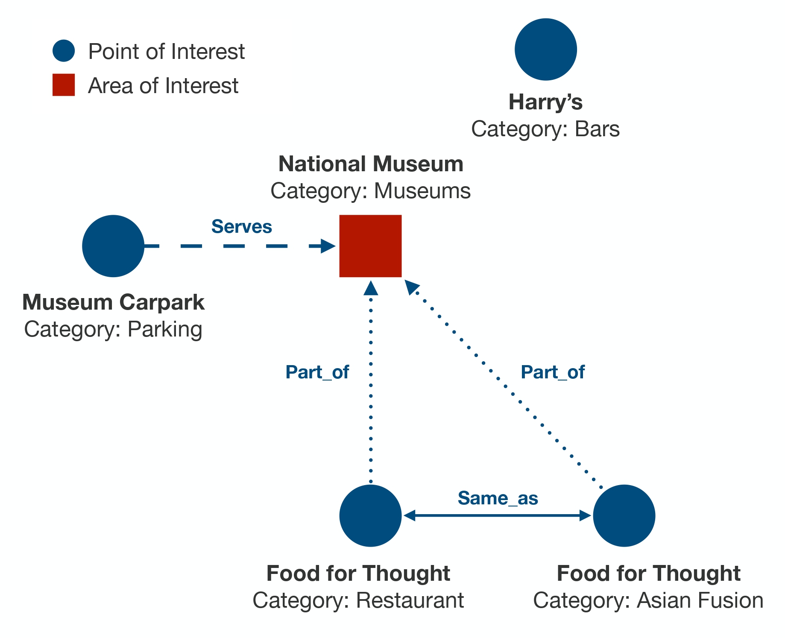

# GTMiner
### Code for 'Mining Geospatial Relationships from Text' paper (SIGMOD 2023)
GTMiner is a link prediction framework to discover geospatial relationships between entities and construct a Knowledge Graph (KG). It relies on advanced text-analysis techniques and refinement procedures, in order to identify such relationships in absence of exact geometrical shapes for the involved entities.

### Geospatial Knowledge Graph

The following image (left) depicts a typical geospatial database. On the right, a geospatial KG links the entities from the database with fine-grained relationships.



### Challenges


### Requirements

* Python 3.7.7
* PyTorch 1.9
* HuggingFace Transformers 4.9.2
* wget 3.2

Install required packages
```
pip install -r requirements.txt
```

### Data
#### Knowledge Graph Completion data files are stored in /data/KGC
Triples are represented as follows:

```
<entity:head> \t <entity:tail> \t <relation:r>
```

Relations with corresponding ID are stored in config.py

#### AOI Search data files are stored in /data/Classification
Data points are represented as follows:
```
<entity:e> \t <label:{0,1}>
```

<br/>

### Training
#### To train the GTMiner Link Prediction system, please use the following command:
```
python train_GTMiner.py \
  --city sin \
  --lm bert \
  --lr 3e-5 \
  --n_epochs 10 \
  --batch_size 32 \
  --max_len 128 \
  --device cuda \
  --finetuning \
  --do_extend \
  --do_repair \
  --save_model
```

* ``--city``: Specify which city's data you wish to use for training. Possible values are ``sin``, ``tor``, ``sea``, ``mel``.
* ``--lm``: Pre-trained language model. Possible values are ``bert``, ``distilbert``, ``roberta``.
* ``--lr``: Learning rate.
* ``--n_epochs``: Number of epochs.
* ``--batch_size``: Batch size.
* ``--max_len``: Max length of the textual sequence in input to the language model.
* ``--device``: Device, can be: ``cpu`` or ``cuda``.
* ``--finetuning``: Language models pre-trained weights can be fronzen. We strongly encourage to use finetuning, instead.
* ``--do_extend``: If this flag is set, the Refinement Extend will be applied.
* ``--do_repair``: If this flag is set, the Refinement Repair will be applied.
* ``--save_model``: If this flag is set, the best model on the validation set, will be saved (the path can be specified in config.py).  

<br/>

#### To train a Classifier for Area of Interest Search, please use the following command:
```
python train_AOI_Classifier.py \
  --city sin \
  --fe bert \
  --lr 3e-5 \
  --alpha 2.0 \
  --beta 1.0 \
  --n_epochs 10 \
  --batch_size 32 \
  --max_len 128 \
  --device cuda \
  --save_model
```

* ``--city``: Specify which city's data you wish to use for training. Possible values are ``sin``, ``tor``, ``sea``, ``mel``.
* ``--fe``: The Feature Extractor. Possible values are ``bert``, ``lstm``. (choosing ``lstm`` will trigger the download of GloVe embeddings)
* ``--lr``: Learning rate.
* ``--alpha``: The weight for positive class in the loss function.
* ``--beta``: The weight for negative class in the loss function.
* ``--n_epochs``: Number of epochs.
* ``--batch_size``: Batch size.
* ``--max_len``: Max length of the textual sequence in input to the language model (Suggested values are 32 for bert and 16 for lstm).
* ``--device``: Device, can be: ``cpu`` or ``cuda``.
* ``--save_model``: If this flag is set, the best model on the validation set, will be saved (the path can be specified in config.py).
